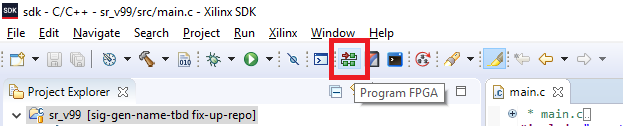
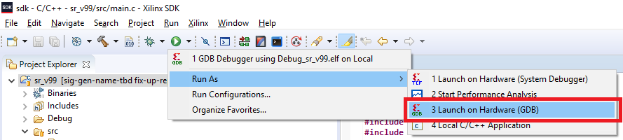

# Overview

This folder contains the necessary files for developing firmware for the signal playback peripheral on the Zybo board.

# Getting started

## Setup

Follow these instructions to get started on developing firmware for the signal playback peripheral on the Zybo board.

1. Install Xilinx SDK 2018.3
2. Open Xilinx SDK 2018.3
3. When promted, use $REPO_PATH/sdk to the repository as your workspace
4. Close the "Welcome" tab
5. Navigate to File -> "Open Projects from File System"
6. Click "Directory..." -> Navigate to $REPO_PATH/sdk
7. Leave all folders checked and select "Finish"
8. In a command line, update your index to ignore changes to the libxil.a file:
```
git update-index --assume-unchanged sdk/sys_v99_4chan_bsp/ps7_cortexa9_0/lib/libxil.a
```

## Running your code

First, load the bitstream to the FPGA with the "Program FPGA" button in the Xilinx SDK:



Then, ensuring you have `main.c` open and selected, run your code on the ARM core:

